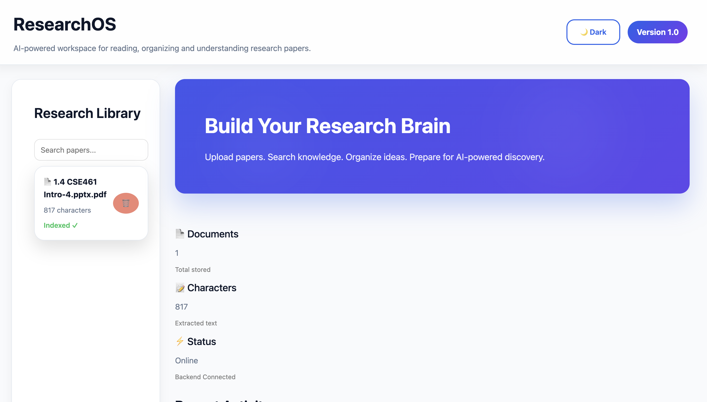
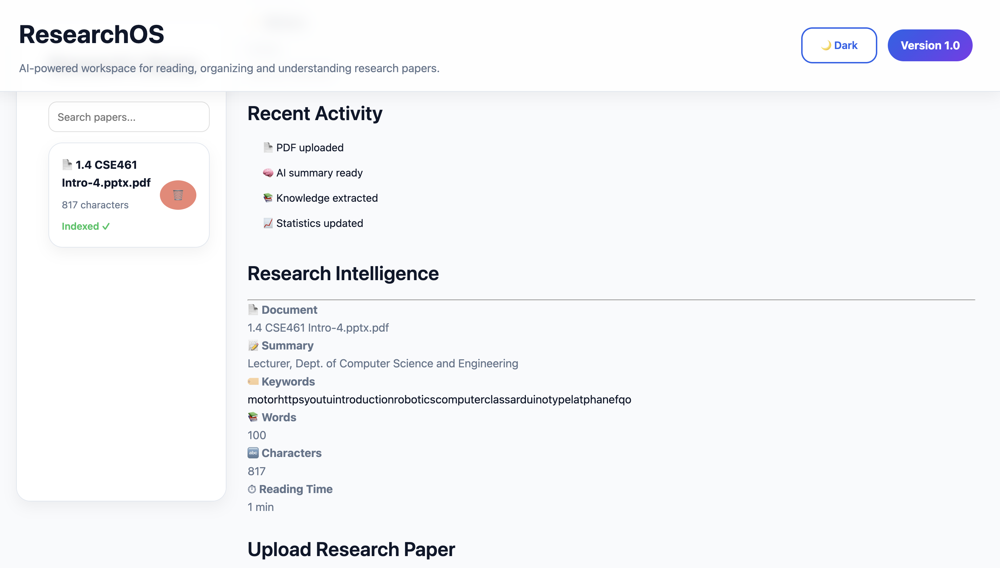
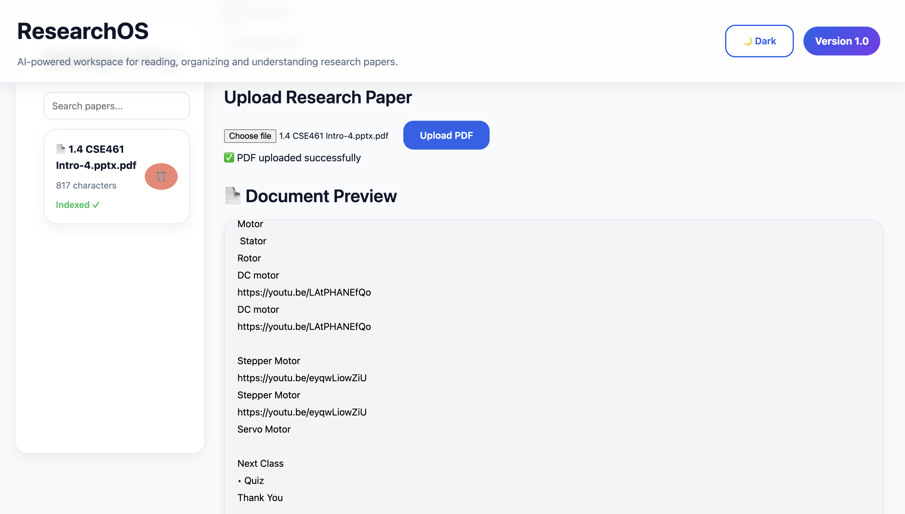
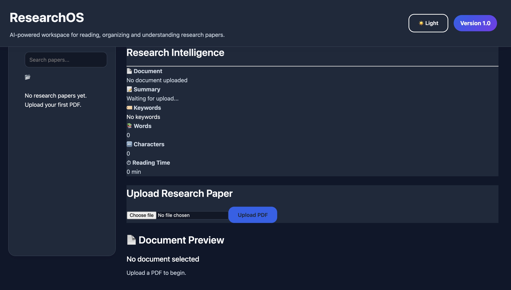

# ResearchOS

> AI-powered research intelligence platform for organizing, analyzing and understanding research papers.


---

## Live Demo

https://researchos-6yrh.onrender.com

---

## Overview

ResearchOS helps researchers upload academic papers, extract structured information, organize documents, and prepare literature reviews using AI-assisted document analysis.

The project combines a FastAPI backend with a React frontend to create an interactive research workspace.

---

## Why ResearchOS?

Reading dozens of research papers is slow, repetitive, and difficult to organize.

ResearchOS was built to reduce that effort by transforming raw academic PDFs into structured knowledge.

Instead of manually reading every document, users can upload papers, generate summaries, extract keywords, estimate reading time, organize documents, and prepare for future AI-powered literature review workflows.

The long-term vision is to build an intelligent research assistant capable of making literature reviews dramatically faster and more organized.

## Features

- PDF upload and management
- Automatic text extraction
- AI document analysis
- Research summary generation
- Keyword extraction
- Reading time estimation
- Word and character statistics
- Research dashboard
- Document preview
- Document deletion
- Live statistics
- Responsive UI
- Dark / Light mode
- REST API backend

## Tech Stack

## System Architecture

```text
                    +----------------------+
                    |      React UI        |
                    |  Dashboard / Upload  |
                    +----------+-----------+
                               |
                               | REST API
                               |
                    +----------v-----------+
                    |      FastAPI         |
                    |    Backend Server    |
                    +----------+-----------+
                               |
          +--------------------+--------------------+
          |                    |                    |
          |                    |                    |
+---------v---------+ +---------v---------+ +--------v--------+
| PDF Extraction    | | Document Analyzer | | SQLite Database |
| (PyPDF)           | | NLP Processing    | | Metadata Store  |
+---------+---------+ +---------+---------+ +--------+--------+
          |                     |                    |
          +---------------------+--------------------+
                                |
                     Structured Research Data
```

## Workflow

```text
Upload PDF
      │
      ▼
Save File
      │
      ▼
Extract Text
      │
      ▼
Analyze Document
      │
      ├── Summary
      ├── Keywords
      ├── Reading Time
      ├── Word Count
      └── Character Count
      │
      ▼
Store in Database
      │
      ▼
React Dashboard Updates
      │
      ▼
Research Card + Statistics + Preview
```

### Frontend

- React
- Vite
- Axios
- CSS

### Backend

- FastAPI
- SQLAlchemy
- SQLite
- PyPDF
- Python

---


## Project Structure

```text
ResearchOS
│
├── backend
│   ├── app
│   │   ├── core
│   │   ├── models
│   │   ├── routers
│   │   ├── services
│   │   ├── nlp
│   │   └── utils
│   ├── uploads
│   └── requirements.txt
│
├── frontend
│   ├── src
│   │   ├── components
│   │   ├── hooks
│   │   ├── pages
│   │   ├── services
│   │   └── App.css
│   └── package.json
│
├── docs
│
└── README.md
```

## Installation

### Clone the repository

```bash
git clone https://github.com/kbhattbhattacharjee-crypto/ResearchOS.git
```

```bash
cd ResearchOS
```

---

### Backend

```bash
cd backend

python -m venv .venv

source .venv/bin/activate

pip install -r requirements.txt

uvicorn app.main:app --reload
```

Backend runs on

```
http://127.0.0.1:8000
```

---

### Frontend

```bash
cd frontend

npm install

npm run dev
```

Frontend runs on

```
http://localhost:5173
```

## Deployment

ResearchOS is deployed on Render.

### Live Website

https://researchos-6yrh.onrender.com

Backend deployment:

- FastAPI
- Render
- Automatic GitHub deployment

Frontend:

- React + Vite


## What I Learned

Through building ResearchOS, I gained hands-on experience with:

- React component architecture
- FastAPI REST APIs
- SQLAlchemy ORM
- File uploads
- PDF text extraction
- NLP preprocessing
- Database design
- API integration
- Git and GitHub workflow
- Full-stack project deployment


## Screenshots

### Home Dashboard



### Research Intelligence




### Upload & Preview



### Dark Mode

